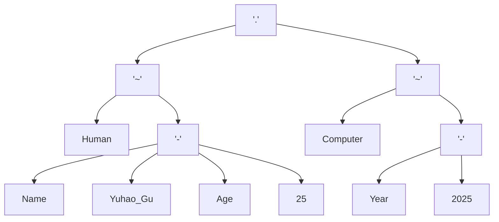

人们常说 “命名是编程中最困难的事情”，但这一挑战绝非局限于代码领域。从代码变量、文件路径、网址链接，到富文本文档、图片海报乃至人工书写、口头沟通，同一名称往往需要在差异极大的环境中被引用、识别和解析。不当命名不仅会造成风格混乱，增加团队认知负担、降低协作效率，还可能引发理解偏差、歧义冲突，甚至导致系统报错、程序崩溃等严重问题。

为解决这一跨场景痛点，本文提出一套普适命名约定（the Universal Convention of Naming，**UCN**），旨在成为默认的命名方案，为任意场景下的命名提供参照指引，进而减少混乱与风险，促进形成一致的命名风格。该约定的核心设计是：先界定严格受限的初始字符集，再通过不同连字符的串接及各类风格变型，生成多套双射命名空间，从而适配不同场景的命名约束，实现跨场景的普适兼容。

## 动机

让我来举一个例子来看看命名的混乱是如何发生的：

1. 假定我开发了一款软件工具，称之为 `Yuhao Gu's ToolBox`，这个名字很自然地出现在了所有文档里；
2. 我需要把软件发布出去，而在打包的时候我发现文件名里包含空格 ` ` 和单引号 `'` 会导致敲命令行时总要转移，于是避免麻烦我把文件命名为 `Yuhao_Gu_s_ToolBox.tgz`；
3. 我想为我的工具搭建一个官网，于是就想去申请域名，而这时我却发现 RFC 1035 标准只允许使用小写字母和减号 `-`，我没办法就只能申请了一个 `yuhao-gu-s-toolbox.com` 的域名；
4. 尔后我又开发了某个上层应用，它的配置文件需要使用 `Yuhao Gu's ToolBox`，且又采用了 `CamelCase` 的命名风格，我别无选择，只能把配置项命名为 `YuhaoGuSToolbox`——这时那个 `'s` 好像无论是大写还是小写已经都不合适了；
5. 当我的用户编写配置文件时，糟心的来了：一个文件中同时包含了四种记法（`Yuhao Gu's ToolBox`、`Yuhao_Gu_s_ToolBox.tgz`、`yuhao-gu-s-toolbox.com`，`YuhaoGuSToolbox`）。他写好了配置文件，却最终在程序运行时遇到了匪夷所思的错误。
6. 等到用户经历了一个下午的排查终于发现是配置中的路径 `ToolBox` 填成了 `Toolbox` 时，用户的心态直接原地爆炸，只想顺着网线爬过来揍我。

这一切问题的根源都来自于最初那个不经意的命名。一旦这种问题发生，再想要修改命名是十分困难的，因为名称的引用通常是单向的。你可能永远都不会知道一个名称到底在多广泛的地方被用到，所以最好的做法是慎重地命名，然后一旦命名之后就永远不再改变

这时，你就希望自己最初的命名能够拥有最大程度的兼容性，适配从今往后的任何潜在可能场景——也正是我提出 UCN 的原因。

## UCN

UCN 的主要设计内容包括四部分：基本型、串接、变体型，以及常见场景中的具体约定。

### 基本型

在给一个孤立的原子事物或概念命名时，组成名称的字符种类应该越少、越简单越好：纯字母比字母和数字好，单词比短语好。在最坏情况下也不应该违反 RFC 1035 中的约束，即：

> 由小写字母/数字/减号组成，只能以字母开头，不能以减号结尾，且减号不能连续出现。

- 以下是符合约定的命名：`entelecheia` `logos21` `lets-go-1`
- 以下是违反约定的命名：`Apeiron` `YuhaoGu` `Let's Go!` `do--something-`

严格遵循 RFC 1035，只使用小写字母、数字和减号，有助于想出方便交流的人类可读名称，因为我们的说话发音中不包含大小写等变型，而减号可用停顿来表达。所以，这种和发音模式的匹配使我相信 RFC 1035 足以在合理的长度内给世间所有事物具名。

我们将减号分隔的每块字母数字称为 **“偏旁”（radical）**。

#### 自然型

基本型的单调记法在很多时候确实不能满足出版物、多媒体等人类之间交流宣发的需要，因此包含特殊字符和花哨写法的名称也可能同时存在，我们称这种名称为 **自然型**。

然而必须强调的是，在标识和区分事物这一点基础功能上，基本型是完全足够的。因此绝不鼓励使用自然型，我们要求所有自然型在定义的同时必须提供一个基本型，且只在面向人类的文本中使用自然型以避免混乱。

### 串接

串接用于表达嵌套组合的命名结构。命名常见组合和嵌套的现象，用于表达复合事物，以及“的”、“和”、“或”等关系。例如，我的名字是 `yuhao-gu`，那么“我的作品”可能会就被命名为 `yuhao-gu.work-01`。

串接总是通过不同的连字符来表达，UCN 定义了一种记法（称为 **串接模式**）来表达多级连字符构成的名称空间，从基本型开始：

- `UCN[-]` 就表示符合前述基本型的命名，例如 `yuhao-gu`；
- `UCN[_]` 表示基本型中的连字符改用 `_`，例如 `yuhao_gu`；
- `UCN[-.]` 允许二级名称，即基本型的串接，例如前述的 `yuhao-gu.work-01`；
- `UCN[_-]` 即使用不同连字符的二级名称，例如 `yuhao_gu-work_01`；
- `UCN[_-.]` 则允许三级名称，更多层级的名称以此类推。

容易证明：

> - 低层级串接模式的空间包含在高层级之中，
> - 同一层级串接模式的命名空间都是相互双射的，因此不会发生重名冲突。

在一些情况下高级名称可能会退化为低级名称，例如符合 `UCN[_-]` 的名称（`yuhao_gu-work_01`）如果第一层级都只有一个偏旁，那么就会退化为 `UCN[-]`：`yuhao-work`。

### 变体型

遵循 RFC 1035 的基本型的显著优势是支持多种多样的变体型：

- `small_case` `UPPER_CASE` `CamelCase` `camelBack`
- `camel+Snake+Back` `Camel-Snake-Case`
- `Leading~upper~snake~case`

容易证明：

> - 所有变体型的命名空间之间都是相互双射的。

因此，这些变体型可以适用多种多样的需求场景，而且不会发生重名冲突（虽然仍然存在退化现象）。

通过串接和变体的组合，可以无歧义地表达很复杂的结构，适合于编程生成与解析：

```
UCN[_-~.] Human~Name-Yuhao_Gu-Age-25.Computer~Year-2025
```



此外还需明确，“基本型”和“串接模式”默认仅指代 `small_case` 的命名，不包含变体型在内。

### 常见场景的具体约定

- 用户名/邮箱名

  直接使用偏旁（即纯字母数字）——相信我这真的会在很多地方避免不必要的麻烦！迫不得已时，使用基本型 `UCN[-]` 或其它一级串接。

- 域名/计算机名

  RFC 1035 的域名命名规范可以用 `UCN[-.]` 来表达。尽管后续的标准（RFC 1123，RFC 5890 等）允许数字开头和 Unicode 字符，但出于兼容性考量永远不推荐这么做。

- 项目/产品名

  必须提供基本型，鼓励直接使用偏旁，可以同时定义自然型但不鼓励。

- 文件名/URL

  遵照 `UCN[-_~.]` 约定，这四个字符是 RFC 3986 中规定仅有的四个非保留字符，遵照此约定命名的文件在暴露到万维网（WWW）时无需经过百分号转义，具有显著的可读性优势。但允许文件名以数字开头，因为这非常常见。

  在此约定下，文件的后缀拓展名自然属于顶级的连字符。如果不考虑拓展名，不超过二级的文件名可以通过将一级连字符替换为一个变体型来获得在常见编程语言中都可用的无冲突的标识符（例如从 `yuhao-gu_book` 派生 `yuhaoGu_book`），适用性非常好。

  遵循此命名约定可以得到非常整洁的目录结构——试想所有 `User Login 2025-01-01.pdf` 都变成 `user-login-20250101.pdf`。

## 评估

为了证明 UCN 的普适性，我找到了很多常见的命名约束，它们都可以被某种 UCN 串接模式满足：

- 大部分编程语言中的变量命名可以被 UCN 体系覆盖，例如 Python PEP8 变量命名约束可以表达为 `UCN[_]`；
- SemVer 版本规范可以表达为 `UCN[.-+]`，如 `1.2.3-beta+202501`；
- Maven 版本同样适配 `UCN[.-+]`，如 `v2.1.0-snapshot`；
- Debian 包命名可被 `UCN[.+-_]` 满足（不考虑后缀名的 `.`），其中前两级用于版本号，如 `nginx-1.25_amd64.deb`；
- RPM 包使用 `.` 作为顶层分隔符，与版本号中的分隔符冲突，例如 `nginx-1.20.1-2.el8.x86_64.rpm`，无法被 UCN 表达；
- OCI 镜像名可以表达为 `UCN[.-:/]`，例如 `mycompany.com/web-service:v2.1`。

当然还有更多，我后面遇到了会继续补充在这里。

## 相关工作

命名规范长期以来在计算机系统、软件工程等领域广泛存在，但大多数规范均聚焦于特定场景，而缺乏跨场景的考量。在编程语言层面，主流语言通常定义各自的标识符约束与首选风格，如 Python 的 PEP8、Go 的命名约定、Java 的 CamelCase 习惯等；在软件工程层面，Debian/RPM/OCI 等体系都会规定专用的命名规范，而 SemVer 为软件版本号的具名提供了比较通用的方案，算是与本文最为接近的工作；互联网和万维网上的命名规范会更多地将跨全球设备的兼容性纳入考量，也因此更为严格，但兼容它们的普遍存在也正是 RCN 的主要设计考量之一。总的来说，这些规范在制定时主要考虑其自身场景内的一致性，却几乎不考虑与其他场景的互通性和泛用性。

在统一命名方面，现有工作主要集中于两个方向：一是通过人为制定团队级或公司级命名指南（如 Google、Microsoft、Airbnb 等的内部风格指南），以人为流程约束减少冲突；二是利用计算工具进行自动转换，如 slugify、camelize 等库将文本转化为“可接受的”程序化名称。这些方法虽在实践中有一定效果，但仅解决局部格式化问题，没有提供能够在不同字符集限制、不同层级结构、不同表示风格之间保持双射关系的完整命名理论。与这些方法相比，UCN 的贡献在于：以受限字符集为核心，通过多级串接模式和系统性变体型构造，从根本为跨多场景的命名预留空间，确保映射的一致性与无歧义性，并能用统一结构解释现有大部分命名规范。

## 总结

本文提出了 UCN（the Universal Convention of Naming），旨在为跨从计算机系统到人类交流的多场景提供一套结构化、可双射、可组合的普适命名方案。通过严格限定基本字符集、定义层级化的串接模式、以及构建系统性的风格变体，UCN 将分散的命名实践统一到单一理论模型下，使同一概念可在差异巨大的命名环境中保持一致性与可解析性。实践表明，UCN 不仅能够覆盖现有绝大多数命名规范，也为构建更可兼容、更易协作的软件与文档生态提供了基础性支撑。

## 附录

### UCN 检查的 Python 代码

```python
def ucn_check(s: str, seps = "-_~.") -> bool:
  """检查 s 是否满足 UCN[{seps}] 的命名模式"""
  # TODO
```

### UCN 转换的 Python 代码

```python
def ucn_convert(s: str, old_seps: str, new_seps: str, case: str | None) -> bool:
  """将 UCN[{old_seps}] 的 s 转换为 UCN[{new_seps}]。
  如果 case 不为 None，则用相应的变体型取代一级连字符。"""
  # TODO
```
